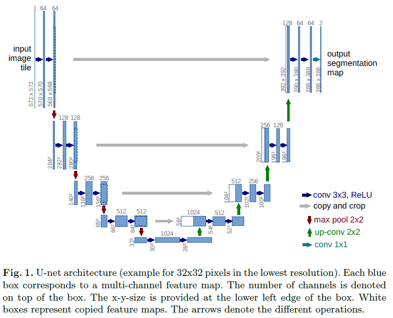

# 道路裂缝检测 - Road Crack Detection

基于 U-Net 深度学习网络的道路裂缝语义分割项目。使用 PyTorch 实现，支持标准 U-Net 和 UNet++ 两种网络结构，并提供完整的 GUI 图形界面。

## 项目简介

这是一个用于道路裂缝检测的深度学习项目，使用语义分割技术识别图像中的裂缝区域。项目包含：
- 完整的数据预处理流程
- 两种 U-Net 网络架构实现（标准 U-Net / UNet++）
- 训练脚本
- 图形界面支持图片检测、视频检测、摄像头实时检测

## 环境依赖

```bash
pip install torch torchvision opencv-python numpy matplotlib scipy pillow wxpython pywin32 torchsummary
```

主要依赖：
- PyTorch - 深度学习框架
- OpenCV - 图像处理
- wxPython - GUI 图形界面
- NumPy, SciPy - 科学计算

## 数据集准备

本项目使用 [CrackForest 数据集](https://github.com/cuilimeng/CrackForest-dataset) 进行训练。

### 数据集结构

下载数据集后，请按以下结构放置：

```
CrackForest-dataset-master/
├── image/              # 原始灰度图像
├── groundTruth/        # .mat 格式标签文件
└── save_model_dir/     # 训练好的模型保存位置
```

### 数据预处理

将 `.mat` 格式的标签转换为 PNG 图像格式：

```bash
python data_preprocess.py
```

这会在 `CrackForest-dataset-master/groundTruthPngImg/` 目录下生成处理后的 PNG 标签文件。

## 训练

### 配置

在 `config.py` 中可以修改训练参数：

```python
epochs = 100                # 训练轮数
train_on_gpu = True         # 是否使用 GPU 训练
model_path = './CrackForest-dataset-master/save_model_dir/unet_road_model.pt'
```

### 训练标准 U-Net

```bash
python train_unet.py
```

### 训练 UNet++

```bash
python train_unet_plus.py
```

训练过程中会输出每个 epoch 的损失，并在训练结束后保存模型和损失曲线。

## 网络结构

### 标准 U-Net



标准 U-Net 由编码器（下采样）和解码器（上采样）组成，通过跳跃连接连接对应层级的特征图。

### UNet++

UNet++ 引入了稠密嵌套跳跃连接，改善了梯度流动和特征聚合，在细分割任务上可能获得更好效果。

## 预测与检测

训练好模型后，可以通过三种方式进行检测：

### 1. 使用图形界面（推荐）

```bash
python gui.py
```

图形界面支持三种检测模式：
- **图片检测** - 选择单张图片进行裂缝检测
- **视频检测** - 对视频文件逐帧进行检测
- **实时检测** - 调用摄像头进行实时裂缝检测
- 按下 `q` 键退出视频/实时检测

> **注意**: 需要修改 `gui.py` 中的模型路径为你训练好的模型路径。

### 2. 单张图片检测

```python
python image_inference.py
```

修改 `image_inference.py` 底部的图片路径后运行，会输出检测结果图像并显示。

### 3. 视频/摄像头检测

`video_inference.py` 中包含视频和摄像头检测的函数，供 GUI 调用。支持按下 `q` 键退出。

## 检测流程

1. 输入图像转换为灰度图并归一化
2. 输入神经网络得到分割预测
3. 后处理使用形态学开操作去噪
4. 使用 HSV 颜色空间提取裂缝区域并绘制绿色边框
5. 显示结果图像

## 项目结构

```
crack/
├── config.py           # 配置文件
├── data_preprocess.py  # 数据预处理：mat → PNG
├── dataset.py          # PyTorch Dataset 数据加载
├── unet.py             # 标准 U-Net 网络结构
├── unet_plus.py        # UNet++ 网络结构
├── train_unet.py       # 标准 U-Net 训练脚本
├── train_unet_plus.py  # UNet++ 训练脚本
├── postprocess.py      # 后处理：裂缝区域框选绘制
├── image_inference.py # 单张图片推理检测
├── video_inference.py # 视频/摄像头实时检测
├── gui.py              # wxPython GUI 主程序
├── docs/               # 文档
│   └── Unet网络.png
├── examples/           # 示例测试图片
├── unused/             # 无关测试文件
└── README.md
```

## 结果说明

- 模型输出为二分类：裂缝 / 背景
- 检测结果中裂缝区域会被高亮显示并用绿色矩形框标注
- 置信度：通过预测输出概率最大值判断分类结果

## 参考资料

- [U-Net: Convolutional Networks for Biomedical Image Segmentation](https://arxiv.org/abs/1505.04597)
- [UNet++: A Nested U-Net Architecture for Medical Image Segmentation](https://arxiv.org/abs/1807.10165)
- [CrackForest Dataset](https://github.com/cuilimeng/CrackForest-dataset)

## License

MIT
